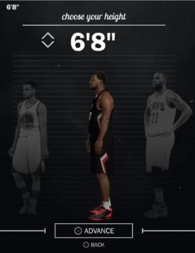
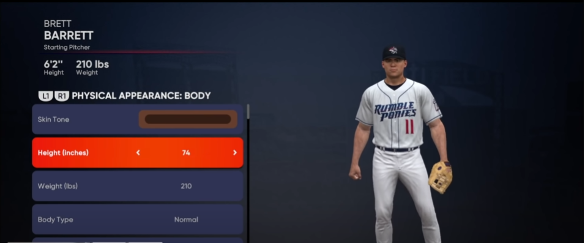

# Your Fit

<h2>Just a small example application that will ultimately serve a much larger purpose.</h2>

 

Throughout my younger years, indulging in my love of video games, I've always wondered how everything worked. Now on my voyage as Software Engineering, I can devise my own solutions to how I think certain things might work. Here is take on adjusting a created players height.

 

# In Game Examples

 

# Application

I attempted to recreate the functionality of someone adjusting a players height in game. You made enter your players name, height in feet and height in inches. This will give you a total height and will adjust your players height accordingly.

<h1>Examples</h1>

# Technologies Used

- HTML
- CSS
- JavaScript
- Adobe Illustrator
